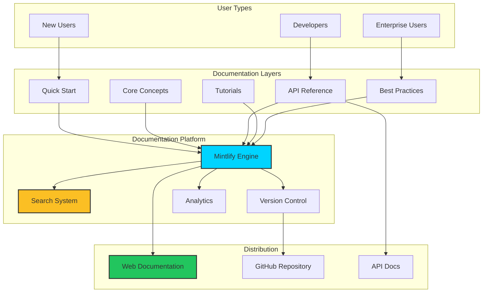

# Aqua Protocol Documentation


> Comprehensive, developer-friendly documentation for Aqua Protocol's blockchain verification and notarization platform.

---

##  About This Documentation

This documentation site serves as the complete resource hub for developers, users, and integrators working with Aqua Protocol. As part of our comprehensive UX/UI redesign initiative, we've completely restructured and streamlined the documentation to provide:

- **Clear, Logical Progression**: Reorganized sections that guide users from basics to advanced topics
- **Enhanced Readability**: Updated explanations with improved clarity and conciseness
- **Developer-Focused**: Practical examples, code snippets, and integration guides
- **Reduced Cognitive Load**: Eliminated information overload through strategic content consolidation
- **Modern Documentation Platform**: Built with Mintlify for an exceptional reading experience

### What We Fixed

The original documentation suffered from:
- Dense, text-heavy pages that overwhelmed readers
- Unclear information hierarchy
- Redundant content across multiple sections
- Difficult navigation for newcomers
- Inconsistent formatting and structure

### Our Solution

We implemented a complete documentation overhaul:
- **Logical Organization**: Information flows naturally from introduction to advanced topics
- **Streamlined Content**: Removed redundancy, consolidated related concepts
- **Visual Enhancements**: Consistent formatting, syntax highlighting, and visual aids
- **Improved Onboarding**: Quick start guides that get users running in minutes
- **Better Discoverability**: Enhanced search and clear navigation structure

---

##  Documentation Coverage

This documentation site provides comprehensive guides and resources for:

###  Getting Started
- Quick start guide for new users
- Platform overview and key concepts
- Installation and setup instructions
- First verification walkthrough

###  Verification Workflows
- Complete verification process guides
- Step-by-step tutorials for common use cases
- Best practices for secure verifications
- Error handling and troubleshooting

###  Schema References
- Data structure documentation
- Schema definitions and examples
- Validation rules and requirements
- Custom schema creation guides

###  Developer Tools
- API reference documentation
- SDK installation and usage
- Code examples in multiple languages
- Integration patterns and recipes
- CLI tool documentation

###  Security & Identity Management
- Authentication and authorization
- Identity verification processes
- Security best practices
- Privacy considerations
- Compliance guidelines

###  Use Cases & Examples
- Real-world implementation examples
- Industry-specific solutions
- Sample projects and templates
- Community contributions

---

##  Documentation Architecture



### Documentation Flow

1. **User Entry**: Different user types (new, developers, enterprise) enter at appropriate levels
2. **Content Layers**: Progressively detailed content from quick start to advanced topics
3. **Mintlify Platform**: Powers search, versioning, and analytics
4. **Multi-Channel Delivery**: Accessible via web, GitHub, and API endpoints

---

## 📁 Project Structure

```
docs/
│
├── quickstart/                  # Quick start guides
│   ├── introduction.mdx         # Platform introduction
│   ├── installation.mdx         # Setup instructions
│   └── first-verification.mdx   # First steps tutorial
│
├── verification/                # Verification workflows
│   ├── overview.mdx             # Workflow overview
│   ├── creating-verification.mdx
│   ├── validating-data.mdx
│   └── advanced-workflows.mdx
│
├── api-reference/               # API documentation
│   ├── authentication.mdx       # Auth methods
│   ├── endpoints/               # API endpoints
│   │   ├── verifications.mdx
│   │   ├── schemas.mdx
│   │   └── identity.mdx
│   └── webhooks.mdx             # Webhook integration
│
├── schemas/                     # Schema references
│   ├── overview.mdx             # Schema basics
│   ├── standard-schemas.mdx     # Pre-built schemas
│   ├── custom-schemas.mdx       # Creating custom schemas
│   └── validation.mdx           # Validation rules
│
├── developer-tools/             # Developer resources
│   ├── sdk/                     # SDK documentation
│   │   ├── javascript.mdx
│   │   ├── python.mdx
│   │   └── typescript.mdx
│   ├── cli.mdx                  # CLI tool guide
│   └── libraries.mdx            # Helper libraries
│
├── security/                    # Security documentation
│   ├── overview.mdx             # Security model
│   ├── authentication.mdx       # Auth strategies
│   ├── identity-management.mdx  # Identity handling
│   └── best-practices.mdx       # Security guidelines
│
├── use-cases/                   # Practical examples
│   ├── document-verification.mdx
│   ├── identity-validation.mdx
│   ├── supply-chain.mdx
│   └── compliance.mdx
│
├── images/                      # Documentation images
├── mint.json                    # Mintlify configuration
├── docs.json                    # Documentation structure
├── package.json                 # Dependencies
├── README.md                    # This file
└── LICENSE                      # MIT License
```

---

## 🚀 Getting Started

### Prerequisites

- **Node.js** (v18.0.0 or higher)
- **npm** or **yarn**
- **Git**

### Installation

1. **Clone the repository**

```bash
git clone https://github.com/AquaProtocol-Hackathon/docs.git
cd docs
```

2. **Install Mintlify CLI globally**

```bash
npm i -g mintlify
```

Or using npm:
```bash
npm install -g mintlify
```

3. **Install project dependencies** (if any)

```bash
npm install
```

### Local Development

1. **Start the development server**

Run the following command at the root of your documentation directory (where `docs.json` is located):

```bash
mintlify dev
```

2. **View your documentation**

Open your browser and navigate to:
```
http://localhost:3000
```

3. **Live Reload**

The documentation will automatically reload when you make changes to any `.mdx` files.

### Troubleshooting

#### Dev environment isn't running

Run the update command to ensure you have the most recent version:
```bash
mintlify update
```

#### Page loads as 404

Make sure you are running the command in a folder with a valid `docs.json` file.

#### Port already in use

If port 3000 is already in use, Mintlify will automatically use the next available port.

---

## 📝 Writing Documentation

### File Format

All documentation is written in **MDX** (Markdown + JSX), which allows you to:
- Use standard Markdown syntax
- Embed React components
- Add interactive elements
- Include code snippets with syntax highlighting

### Example Page Structure

```mdx
---
title: "Page Title"
description: "Brief description of the page content"
---

# Main Heading

Introduction paragraph explaining the topic.

## Section Heading

Content for this section with [links](https://example.com) and **bold text**.

### Code Example

```javascript
// Code snippet with syntax highlighting
const verification = await aqua.verify({
  data: "example data",
  schema: "standard-v1"
});
```

<Note>
  Important information for readers
</Note>

<Warning>
  Critical warnings or cautions
</Warning>


### Documentation Components

Mintlify provides several built-in components:

- `<Note>` - Highlight important information
- `<Warning>` - Display warnings or cautions
- `<Info>` - Show informational callouts
- `<Tip>` - Provide helpful tips
- `<Check>` - Show success or completion states
- `<CodeGroup>` - Display code in multiple languages

### Content Guidelines

1. **Be Concise**: Get to the point quickly
2. **Use Examples**: Show, don't just tell
3. **Progressive Disclosure**: Start simple, add complexity gradually
4. **Visual Aids**: Include diagrams, screenshots, and code snippets
5. **Consistent Formatting**: Follow established patterns
6. **Accessibility**: Use clear headings and alt text for images

---

## 🚀 Deployment

### Automatic Deployment

This documentation is configured for automatic deployment:

1. **Install GitHub App**

   Install the Mintlify GitHub app from your [dashboard](https://dashboard.mintlify.com/settings/organization/github-app) to propagate changes from your repo to your deployment.

2. **Push to Main Branch**

   Changes are automatically deployed to production after pushing to the default branch:

   ```bash
   git add .
   git commit -m "Update documentation"
   git push origin main
   ```

3. **Deployment Status**

   Check deployment status in the Mintlify dashboard.

### Manual Deployment

If needed, you can manually trigger deployment through the Mintlify dashboard.

---

##  Customization

### Branding

Update `mint.json` to customize the documentation appearance:

```json
{
  "name": "Aqua Protocol",
  "logo": {
    "light": "/logo/light.svg",
    "dark": "/logo/dark.svg"
  },
  "colors": {
    "primary": "#00d4ff",
    "light": "#90e0ef",
    "dark": "#023e8a"
  },
  "topbarLinks": [
    {
      "name": "Website",
      "url": "https://aquaprotocol.com"
    }
  ]
}
```

### Navigation

Configure navigation structure in `mint.json`:

```json
{
  "navigation": [
    {
      "group": "Getting Started",
      "pages": [
        "quickstart/introduction",
        "quickstart/installation"
      ]
    },
    {
      "group": "API Reference",
      "pages": [
        "api-reference/authentication",
        "api-reference/endpoints"
      ]
    }
  ]
}
```

---

## 🤝 Contributing

We welcome contributions to improve the documentation! Here's how:

### Contributing Guidelines

1. **Fork the repository**

2. **Create a feature branch**

```bash
git checkout -b docs/improve-verification-guide
```

3. **Make your changes**

   - Follow the MDX format
   - Maintain consistent style and tone
   - Add examples and code snippets
   - Test locally with `mintlify dev`

4. **Commit your changes**

```bash
git commit -m "docs: Improve verification workflow guide"
```

Use conventional commits:
- `docs:` Documentation updates
- `fix:` Fix typos or errors
- `feat:` Add new documentation pages
- `style:` Formatting improvements
- `refactor:` Restructure content

5. **Push and create Pull Request**

```bash
git push origin docs/improve-verification-guide
```

### Documentation Standards

- **Clarity**: Write for your audience (beginners to experts)
- **Accuracy**: Verify all code examples work
- **Consistency**: Follow existing patterns and style
- **Completeness**: Include prerequisites, steps, and expected outcomes
- **Maintenance**: Update outdated information

---

## 🔍 Search Optimization

### Search Features

- **Full-text search** across all documentation
- **Instant results** as you type
- **Relevance ranking** for better results
- **Keyboard shortcuts** (Cmd/Ctrl + K)

### Improving Search

To improve search results for your pages:

1. Add descriptive titles and descriptions in frontmatter
2. Use clear headings (H2, H3)
3. Include relevant keywords naturally
4. Add synonyms in content

```mdx
---
title: "Complete Verification Guide"
description: "Learn how to verify documents, validate identity, and create secure blockchain verifications"
---
```

---

##  Analytics & Insights

Track documentation usage through Mintlify analytics:

- **Page views** and popular content
- **Search queries** to identify gaps
- **User feedback** on helpful/unhelpful pages
- **Navigation patterns** to optimize structure

Access analytics in your [Mintlify dashboard](https://dashboard.mintlify.com).

---

## 🛠️ Tech Stack

- **Documentation Platform**: Mintlify
- **Content Format**: MDX (Markdown + JSX)
- **Version Control**: Git, GitHub
- **Deployment**: Mintlify Cloud (automatic)
- **Search**: Mintlify Search Engine
- **Analytics**: Mintlify Analytics

---

## 📄 License

This documentation is licensed under the **MIT License**. See the [LICENSE](LICENSE) file for details.

---

## 🙏 Acknowledgments

- **Aqua Protocol Team**: For their vision and collaboration

---

<div align="center">

**Documentation crafted with 💙 by the Wild Flower Team**

[🔗 Visit Live Documentation](https://docs.aquaprotocol.com)

[⬆ Back to Top](#aqua-protocol-documentation)

</div>
